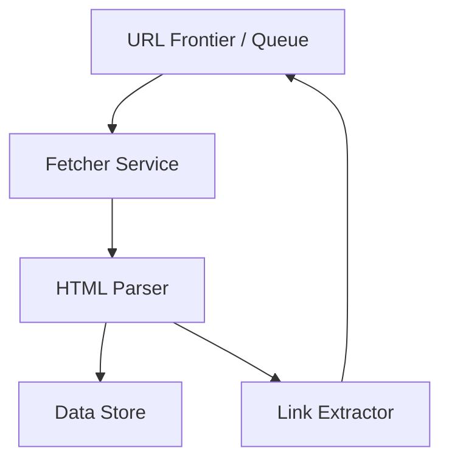

# Web Crawler — System Design Document

## 1. Overview

A simple web crawler that fetches web pages, extracts links, and stores the data for further analysis (e.g., indexing or data mining). 

---

## 2. High-Level Architecture

**Components**

* **URL Frontier / Queue**: Holds the list of URLs to crawl (e.g., Kafka, RabbitMQ, or simple in-memory queue).
* **Fetcher Service**: Sends HTTP requests and retrieves page content.
* **HTML Parser**: Extracts useful data (text, metadata).
* **Link Extractor**: Finds new links on each page and pushes them back to the URL Frontier.
* **Data Store**: Saves fetched pages or extracted metadata (could be a database or object storage).

---

## 3. Functional Requirements

* **Seed Input**: Accept a starting list of URLs.
* **Fetch Content**: Download HTML for each URL.
* **Extract Links**: Identify and enqueue new URLs from fetched pages.
* **Deduplication**: Avoid crawling the same URL repeatedly.
* **Politeness / Rate Limiting**: Respect robots.txt and add configurable delays between requests.
* **Data Storage**: Store raw HTML or key metadata for later use (e.g., indexing).
* **Monitoring**: Provide simple metrics (pages crawled, queue size).

---

## 4. Non-Functional Requirements

* **Scalability**: Must handle increasing URLs by adding more crawler workers.
* **Reliability**: Should resume from the queue after a crash without losing seed URLs.
* **Performance**: Crawl thousands of pages per hour with low latency per fetch.
* **Fault Tolerance**: Failures (network timeouts, invalid pages) are retried or skipped without halting the system.
* **Extensibility**: Easy to plug in new parsers or data sinks later (e.g., search index).
* **Resource Control**: Configurable concurrency limits to avoid overloading target sites.

---

## 5. Key Use Cases

* **Search Engine Indexing**: Gather and store page content to build a searchable index of websites.
* **Price Monitoring**: Regularly crawl e‑commerce sites to track product prices and availability.
* **Content Aggregation**: Collect blog posts or news articles for a recommendation or news‑feed app.
* **SEO Analysis**: Crawl a specific domain to check for broken links, page titles, or metadata quality.
* **Academic or Market Research**: Gather publicly available data sets such as job postings or product reviews.

---

## 6. Technology Choices (Simple Options)

* **Language**: Java with Spring Boot (to match team skillset).
* **Queue**: Kafka or RabbitMQ for distributed crawling.
* **Data Store**: PostgreSQL or Amazon S3 for raw data.
* **Deployment**: Docker containers or Kubernetes for horizontal scaling.

# **high-level walk-through** of the flow  step by step along with possible technology usage:

---

### 1️⃣ URL Frontier / Queue

* Start with a **seed list of URLs** you want to crawl.
* These URLs are placed in a queue (for example, Kafka, RabbitMQ, or an in-memory queue).
* This queue is the *source of truth* for what needs to be fetched next.

### 2️⃣ Fetcher Service

* Worker processes (or crawler nodes) pull URLs from the queue.
* Each worker sends an **HTTP request** to the target website and downloads the raw HTML content.
* If a page is unreachable, the worker logs the error and either retries or skips it.

### 3️⃣ HTML Parser

* The downloaded HTML is passed to a parser that cleans and structures the content.
* It extracts any information we care about (title, body text, metadata).

### 4️⃣ Link Extractor

* While parsing, the crawler also **collects all hyperlinks** on the page.
* These new links are checked for duplicates and robots.txt rules.
* Valid new URLs are **pushed back to the URL Frontier**, so the queue never runs dry.

### 5️⃣ Data Store

* The parsed content and key metadata are saved in a **Data Store** (database, S3, or other storage).
* This provides a permanent record for search indexing, analytics, or other downstream uses.

---

**End-to-End Summary:**
The crawler begins with a small list of seed URLs, then repeatedly:

1. **Takes a URL from the queue → fetches the page → parses it → extracts new links → stores data → re-enqueues new URLs.**

This loop continues until there are no new URLs or until a configured limit is reached.
Because each stage (queue, fetcher, parser, storage) is separate, you can scale horizontally by adding more fetcher or parser workers without changing the overall design.

