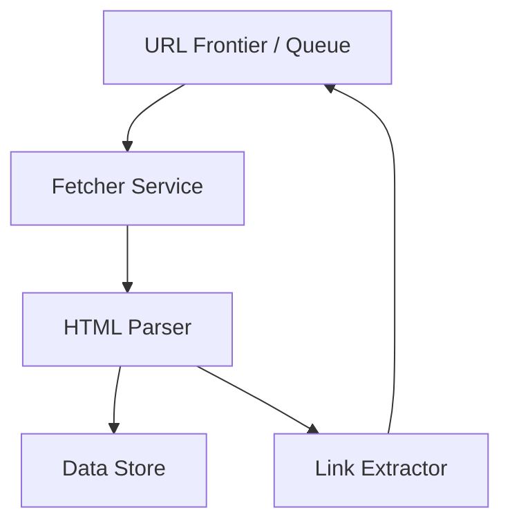

# Web Crawler — System Design Document

## 1. Overview

A simple web crawler that fetches web pages, extracts links, and stores the data for further analysis (e.g., indexing or data mining). 

Certainly! Here's a **clean, concise, and well-structured** rewrite of your explanation:

---

### 🌐 What Is a Web Crawler?

A **web crawler** (also known as a **spider** or **web robot**) is a program that automatically browses the internet to collect data from web pages.

---

### 🛠️ What It Does:

1. Starts with a list of **seed URLs**.
2. Visits each URL, downloads the page’s **HTML**, and extracts content such as:

   * Text
   * Metadata
   * Links
3. Adds new links it discovers to the list of URLs to visit.
4. Repeats the process until a limit is reached or all targets are crawled.

---

### 👨‍💻 Who Creates Web Crawlers?

* **Search engines** (e.g., Google, Bing)
  → To index websites and keep search results up to date.

* **Companies**
  → For use cases like **price tracking**, **market research**, or **news monitoring**.

* **Researchers & developers**
  → For SEO audits, academic studies, or personal projects.

---

### 🧑‍💻 Can Anyone Build One?

Yes. Anyone with programming skills can build a crawler using tools and languages like:

* **Python** (`Scrapy`, `BeautifulSoup`)
* **Java** (`JSoup`, `Apache Nutch`)
* **Go**, **Node.js**, etc.

---

### ✅ Summary

A web crawler is simply software that **automates the process of visiting websites and extracting data**—
commonly used in search engines, business intelligence, and research.
It’s not owned by any one company; **any developer or organization can create one**.

---

Let me know if you'd like a visual diagram or code example to go along with this.


---

## 2. High-Level Architecture



**Components**

* **URL Frontier / Queue**: Holds the list of URLs to crawl (e.g., Kafka, RabbitMQ, or simple in-memory queue).
* **Fetcher Service**: Sends HTTP requests and retrieves page content.
* **HTML Parser**: Extracts useful data (text, metadata).
* **Link Extractor**: Finds new links on each page and pushes them back to the URL Frontier.
* **Data Store**: Saves fetched pages or extracted metadata (could be a database or object storage).

---

## 3. Functional Requirements

* **Seed Input**: Accept a starting list of URLs.
* **Fetch Content**: Download HTML for each URL.
* **Extract Links**: Identify and enqueue new URLs from fetched pages.
* **Deduplication**: Avoid crawling the same URL repeatedly.
* **Politeness / Rate Limiting**: Respect robots.txt and add configurable delays between requests.
* **Data Storage**: Store raw HTML or key metadata for later use (e.g., indexing).
* **Monitoring**: Provide simple metrics (pages crawled, queue size).

---

## 4. Non-Functional Requirements

* **Scalability**: Must handle increasing URLs by adding more crawler workers.
* **Reliability**: Should resume from the queue after a crash without losing seed URLs.
* **Performance**: Crawl thousands of pages per hour with low latency per fetch.
* **Fault Tolerance**: Failures (network timeouts, invalid pages) are retried or skipped without halting the system.
* **Extensibility**: Easy to plug in new parsers or data sinks later (e.g., search index).
* **Resource Control**: Configurable concurrency limits to avoid overloading target sites.

---

## 5. Key Use Cases

* **Search Engine Indexing**: Gather and store page content to build a searchable index of websites.
* **Price Monitoring**: Regularly crawl e‑commerce sites to track product prices and availability.
* **Content Aggregation**: Collect blog posts or news articles for a recommendation or news‑feed app.
* **SEO Analysis**: Crawl a specific domain to check for broken links, page titles, or metadata quality.
* **Academic or Market Research**: Gather publicly available data sets such as job postings or product reviews.

---

## 6. Technology Choices (Simple Options)

* **Language**: Java with Spring Boot (to match team skillset).
* **Queue**: Kafka or RabbitMQ for distributed crawling.
* **Data Store**: PostgreSQL or Amazon S3 for raw data.
* **Deployment**: Docker containers or Kubernetes for horizontal scaling.

# **high-level walk-through** of the flow  step by step along with possible technology usage:

---


### 1️⃣ URL Frontier / Queue

* Start with a **seed list of URLs** you want to crawl.
* These URLs are placed in a queue (for example, Kafka, RabbitMQ, or an in-memory queue).
* This queue is the *source of truth* for what needs to be fetched next.

### 2️⃣ Fetcher Service

* Worker processes (or crawler nodes) pull URLs from the queue.
* Each worker sends an **HTTP request** to the target website and downloads the raw HTML content.
* If a page is unreachable, the worker logs the error and either retries or skips it.

### 3️⃣ HTML Parser

* The downloaded HTML is passed to a parser that cleans and structures the content.
* It extracts any information we care about (title, body text, metadata).

### 4️⃣ Link Extractor

* While parsing, the crawler also **collects all hyperlinks** on the page.
* These new links are checked for duplicates and robots.txt rules.
* Valid new URLs are **pushed back to the URL Frontier**, so the queue never runs dry.

### 5️⃣ Data Store

* The parsed content and key metadata are saved in a **Data Store** (database, S3, or other storage).
* This provides a permanent record for search indexing, analytics, or other downstream uses.

---

# **End-to-End Summary:**
The crawler begins with a small list of seed URLs, then repeatedly:

1. **Takes a URL from the queue → fetches the page → parses it → extracts new links → stores data → re-enqueues new URLs.**

This loop continues until there are no new URLs or until a configured limit is reached.
Because each stage (queue, fetcher, parser, storage) is separate, you can scale horizontally by adding more fetcher or parser workers without changing the overall design.

Absolutely! Let me explain the main data flow in simple terms with the numbered references:

## Web Crawler Data Flow - Simple Explanation

**1. Seed URLs → URL Frontier (Kafka)**
- You start by giving the system a list of websites you want to crawl (like "crawl google.com, facebook.com")
- These starting URLs get put into a waiting line (queue) managed by Kafka

**2. URL Frontier → Fetcher Service** 
- The Fetcher Service is like a worker that says "give me the next website to visit"
- It picks up one URL from the waiting line

**3. Fetcher Service → External Websites**
- The Fetcher Service visits that website (sends HTTP request)
- Like opening a web browser and going to the website

**4. External Websites → Fetcher Service**
- The website sends back its HTML page content
- Like the webpage loading in your browser

**5. Fetcher Service → HTML Parser Service**
- The raw HTML code gets sent to the HTML Parser
- The parser's job is to understand what's on the page

**6. HTML Parser Service → Data Store**
- The useful information (text, titles, images) gets saved in the database
- This is like bookmarking and saving the important parts of the webpage

**7. HTML Parser Service → Link Extractor Service**
- The HTML Parser also sends the page content to find all the links on that page
- Like finding all the clickable links on a webpage

**8. Link Extractor Service → URL Frontier (Kafka)**
- All the new links found get added back to the waiting line
- Now the system has more websites to visit, and the cycle repeats

**The Loop:** Steps 2-8 keep repeating until there are no more URLs to crawl or you stop the system.

## Details of other compoment

Let me explain each component in detail:

## **Fetcher Service Components:**

### **1. HTTP Client**
- **Purpose**: Makes actual HTTP requests to websites
- **Function**: Handles GET/POST requests, manages timeouts, retries failed requests
- **Why needed**: Core component that physically downloads web pages

### **2. Rate Limiter** 
- **Purpose**: Controls how fast we crawl websites
- **Function**: Ensures we don't send too many requests per second to same domain
- **Why needed**: Prevents overwhelming target servers (politeness), avoids getting blocked/banned

### **3. robots.txt Parser**
- **Purpose**: Respects website crawling rules
- **Function**: Reads robots.txt files to check what URLs we're allowed to crawl
- **Why needed**: Legal/ethical compliance - respects website owner's wishes

### **4. URL Deduplication (Bloom Filter)**
- **Purpose**: Prevents crawling same URL multiple times
- **Function**: Keeps track of already-visited URLs using memory-efficient Bloom Filter
- **Why needed**: Saves bandwidth, storage, and prevents infinite loops

---

## **Data Store Components:**

### **1. Raw HTML Storage (S3)**
- **What it stores**: Complete HTML source code of web pages
- **Why S3**: 
  - **Cheap storage** for large amounts of data
  - **Scalable** - can store petabytes
  - **Durable** - won't lose data
  - **Cold storage** - rarely accessed but kept for backup/reprocessing

### **2. Metadata DB (PostgreSQL)**
- **What metadata we store**:
  - **URL, title, description** of each page
  - **Crawl timestamp** (when was it crawled)
  - **Content length, response code** (200, 404, etc.)
  - **Domain information** (which website it came from)
  - **Link count** (how many links found on page)
  - **Content type** (HTML, PDF, etc.)
- **Why PostgreSQL**: Fast queries, relationships between data, ACID compliance

### **3. Cache Layer (Redis)**
- **What it caches**:
  - **Recently crawled URLs** (fast duplicate checking)
  - **robots.txt files** (avoid re-downloading same rules)
  - **DNS lookups** (website IP addresses)
  - **Popular page metadata** (frequently accessed data)
- **Why needed**: 
  - **Speed** - RAM is 1000x faster than disk
  - **Reduces database load** - fewer queries to PostgreSQL
  - **Quick duplicate detection** - instant URL checking

## **Why This Architecture?**

- **S3** = Long-term, cheap storage for raw HTML (like a warehouse)
- **PostgreSQL** = Fast, structured queries for metadata (like a filing system)  
- **Redis** = Lightning-fast temporary storage (like your desk drawer for frequently used items)

# Web Crawler — Low-Level System Design Document

This document describes the **database schema**, **APIs**, **sample data**, and how the APIs interact with the architecture components.
It is written to be copy-paste ready for a 30-minute system-design interview.

---

## 1. Overview

A distributed web crawler that:

* Accepts seed URLs
* Fetches HTML pages
* Extracts links and metadata
* Stores raw pages and metadata for later indexing or analysis

---

## 2. High-Level Architecture


**Key Services**

* **URL Frontier / Queue** – Kafka, RabbitMQ, or in-memory queue holding URLs to crawl.
* **Fetcher Service** – Sends HTTP requests and downloads HTML.
* **HTML Parser** – Cleans and extracts content/links.
* **Link Extractor** – Feeds new links back into the queue.
* **Data Store** – PostgreSQL + Amazon S3 for structured metadata and raw HTML.
* **API Service** – Spring Boot app exposing REST APIs for operators and downstream tools.

---

## 3. Database Schema

**Table: `pages`**
Stores metadata for every crawled page.

| Column         | Type         | Notes                      |
| -------------- | ------------ | -------------------------- |
| id (PK)        | BIGSERIAL    | Auto-increment primary key |
| url            | TEXT         | Full URL                   |
| domain         | VARCHAR(255) | Extracted domain           |
| title          | TEXT         | Page `<title>`             |
| status_code    | INT          | HTTP status                |
| content_length | BIGINT       | Size in bytes              |
| crawl_time     | TIMESTAMP    | When the page was fetched  |
| s3_path        | TEXT         | S3 location of raw HTML    |
| links_found    | INT          | Number of links extracted  |

*Indexes:* `(domain)`, `(crawl_time)` for fast filtering.

---

## 4. REST APIs

A lightweight **Spring Boot API Service** provides control and query endpoints.

| Endpoint             | Method   | Purpose                             | Typical Caller                   | Backend Service Handling It            |
| -------------------- | -------- | ----------------------------------- | -------------------------------- | -------------------------------------- |
| `/api/v1/seeds`      | **POST** | Add new seed URLs to start a crawl  | Admin dashboard, ops script      | **URL Frontier / Queue Service**       |
| `/api/v1/status`     | **GET**  | Current crawl stats                 | Monitoring/alerting tools        | **Monitoring module + Queue/Fetcher**  |
| `/api/v1/pages/{id}` | **GET**  | Retrieve metadata for a single page | Data scientists, analytics tools | **Data Store Service (PostgreSQL/S3)** |
| `/api/v1/pages`      | **GET**  | Search pages by domain or filter    | Reporting/indexing jobs          | **Data Store Service (PostgreSQL/S3)** |

### 4.1 Add Seed URLs

`POST /api/v1/seeds`
**Who calls it:** Operator UI or automation script.
**Hits service:** URL Frontier / Queue.

Request

```json
{
  "urls": [
    "https://example.com",
    "https://news.ycombinator.com"
  ]
}
```

Response

```json
{
  "message": "Seed URLs queued",
  "count": 2
}
```

### 4.2 Get Crawl Status

`GET /api/v1/status`
**Who calls it:** Monitoring system or on-call engineer.
**Hits service:** Monitoring module + Queue/Fetcher.

Response

```json
{
  "pagesCrawled": 1250,
  "queueSize": 340,
  "lastCrawlTime": "2025-09-27T17:05:00Z"
}
```

### 4.3 Retrieve Page Metadata

`GET /api/v1/pages/{id}`
**Who calls it:** Internal analytics or admin UI.
**Hits service:** Data Store Service.

Response

```json
{
  "id": 42,
  "url": "https://example.com",
  "domain": "example.com",
  "title": "Example Domain",
  "status_code": 200,
  "content_length": 23456,
  "crawl_time": "2025-09-27T16:00:00Z",
  "s3_path": "s3://crawler-raw/example.com/2025-09-27/page42.html",
  "links_found": 12
}
```

### 4.4 Search Pages by Domain

`GET /api/v1/pages?domain=example.com&limit=10`
**Who calls it:** Reporting or search-index builder.
**Hits service:** Data Store Service.

Response

```json
[
  {
    "id": 42,
    "url": "https://example.com",
    "title": "Example Domain",
    "status_code": 200,
    "crawl_time": "2025-09-27T16:00:00Z"
  },
  {
    "id": 43,
    "url": "https://example.com/about",
    "title": "About Example",
    "status_code": 200,
    "crawl_time": "2025-09-27T16:05:00Z"
  }
]
```

---

## 5. Sample Insert Data

Example row for the `pages` table:

```sql
INSERT INTO pages
(url, domain, title, status_code, content_length, crawl_time, s3_path, links_found)
VALUES
('https://example.com',
 'example.com',
 'Example Domain',
 200,
 23456,
 '2025-09-27 16:00:00',
 's3://crawler-raw/example.com/2025-09-27/page42.html',
 12);
```

---

## 6. Component Interaction (High-Level Flow)

1. **Seed URLs → URL Frontier**
   *Admin adds seeds through `POST /api/v1/seeds`.*
2. **Fetcher Service** pulls URLs, downloads HTML.
3. **HTML Parser & Link Extractor** process pages, add new URLs back to the queue.
4. **Data Store Service** saves raw HTML (S3) and metadata (PostgreSQL).
5. **API Service** exposes the above REST endpoints to operators and downstream tools.

---

## 7. Key Considerations

* **Scalability** – Add more fetcher workers to increase crawl rate.
* **Fault Tolerance** – Kafka/RabbitMQ ensures messages survive crashes.
* **Politeness** – Rate limiter + robots.txt parser avoid overwhelming sites.
* **Extensibility** – New parsers or sinks (e.g., Elasticsearch) can be added with minimal change.

---

This single consolidated document contains everything needed to describe the **low-level design**, API responsibilities, callers, and their mapping to the crawler’s architecture.


